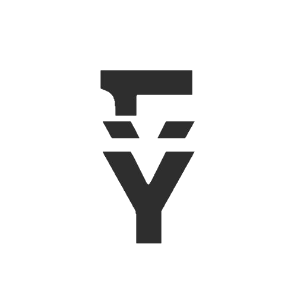

<div align="center">


# Y1

### Software Developer · Frontend Focused

Building **clean interfaces, interactive experiences & useful digital products.**

<br>


<br><br>

[](https://y1dev.vercel.app/)
[](#)
[](https://github.com/YOUR_USERNAME)

</div>

---

## `> whoami`

```ts
const developer = {
  name: "Yousef Abdelaziz",
  brand: "Y1",
  role: "Software Developer",
  focus: "Frontend Development",
  currently: "Building & learning",
  mindset: "Design → Code → Ship → Improve"
};
```

I enjoy turning ideas into **fast, responsive and polished interfaces**.

My main focus is frontend development with **React, Next.js, TypeScript and modern UI systems**, while also being comfortable working across the backend when the project needs it.

---

## ⚡ What I Build

```text
┌──────────────────────────────────────────────────────────┐
│                                                          │
│   ◉ Modern Web Apps        ◉ Interactive Interfaces      │
│                                                          │
│   ◉ Dashboards             ◉ Admin Systems              │
│                                                          │
│   ◉ Landing Pages          ◉ Full-Stack Products        │
│                                                          │
│   ◉ APIs & Services        ◉ Motion-driven Experiences  │
│                                                          │
└──────────────────────────────────────────────────────────┘
```

I care about the details that make a product feel **intentional**:

* Responsive layouts
* Smooth interactions
* Clean component architecture
* Accessibility
* Performance
* Scalable frontend systems
* Thoughtful animations

---

## 🧠 Tech I Work With

<div align="center">

### Frontend


### Backend & Data


### Tools


</div>

---

## 🚀 Selected Work

### 🏗️ Express Blech

A modern steel-construction e-commerce experience with dynamic product configuration.

**Next.js · Node.js · Tailwind CSS · API-driven UI**

→ [View Project](https://express-blech.vercel.app/)

---

### ☀️ Gomaa Solar

A motion-focused solar energy website built around a clean visual experience.

**React · TypeScript · Framer Motion**

→ [View Project](https://gomaa-v1.vercel.app/)

---

### 📚 American House

An English-learning platform with booking and communication functionality.

**React · Next.js · UI/UX · Real-world workflows**

→ [View Project](https://americanhouseonline.com/)

---

### 🧩 Router+

A React-based internet voucher / router management system.

**React · PHP · API Integration**

→ [View Project](https://router-plus.com/)

---

## 📈 Currently Building

```text
Y1
│
├── 🎨 Better UI systems
├── ⚡ Faster React applications
├── 🧠 Stronger TypeScript architecture
├── 🐍 Python & backend development
├── 🎞️ Motion & interactive experiences
└── 🚀 Shipping more real-world products
```

> Learning isn't a side quest.
> **It's part of the build.**

---

## 🎯 My Development Philosophy

### `01` — Keep it simple

Complexity should solve a problem, not create one.

### `02` — Make it feel good

Good software isn't only functional.

It should **feel intentional**.

### `03` — Build real things

Tutorials teach concepts.

Projects teach **engineering**.

### `04` — Keep improving

```text
Build
  ↓
Break
  ↓
Understand
  ↓
Fix
  ↓
Improve
  ↓
Repeat
```

---

## 🖥️ A Little More About Me

```diff
+ Frontend enthusiast
+ React / Next.js developer
+ UI & interaction focused
+ Full-stack capable
+ Always experimenting
+ Always building

- "It works, ship it."
+ "It works. Now make it better."
```

---

## 🌐 Find Me

<div align="center">

**Y1 · Yousef Abdelaziz**

Software Developer
Frontend-focused · Builder · Learner

<br>

<a href="https://y1dev.vercel.app/">

</a>

<br><br>


</div>

---

<div align="center">

### `Y1`

**Design it. Build it. Ship it.**

<br>



<br><br>

<sub>© Yousef Abdelaziz · Y1</sub>

</div>
